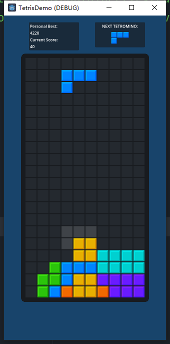
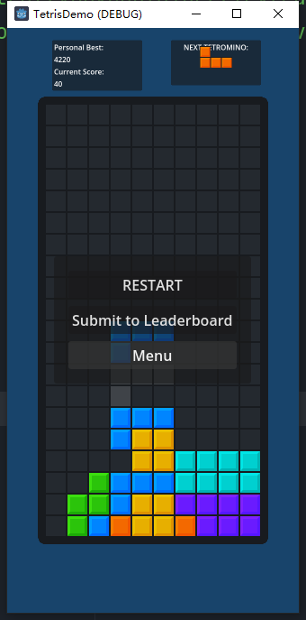
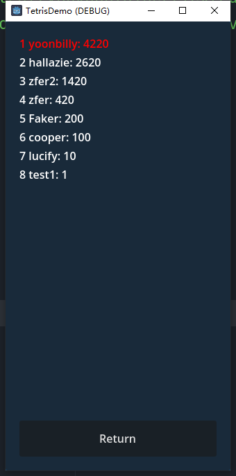

# Getting Started

This is a simple Tetris Demo that applied with a leaderboard stored on block chain, showcasing the ability to develope fully on-chain game with Godot Engine, with our custom module https://github.com/qingfengzxr/gdscript-web3 for GDScript.

In this demo, all the score you submit will stored in a OP contract, and holding a global leaderboard of the Tetris game.

Basic Control:

* `A` and `D` for moving brick left or right

* `S` for accelerate dropping

* `Space` for instant dropping

* `Q` and `E` for rotating brick

Your personal best score and current score will shown at top left. And next brick will shown at top right.



To restart or return to menu, please press `Esc` button.



## Login & Logout

You can create a account for the leaderboard by login with Username and your OP PrivateKey.

The PrivateKey will only stored at local for communicating with the contract. You can delete the stored PrivateKey anytime by logout. The data is stored at Godot's default userdata path (user://). 

```
Windows: %APPDATA%\Godot\app_userdata\[project_name]
macOS: ~/Library/Application Support/Godot/app_userdata/[project_name]
Linux: ~/.local/share/godot/app_userdata/[project_name]
```

To get more detail of local userdata storage please refer to https://docs.godotengine.org/en/stable/tutorials/io/data_paths.html

## Play

You can play Tetris either you have login or not. Once the current game is finished, you will be able to submit your score to OP contract if you have login.

## Leaderboard

The leaderboard will show top 100 score on the chain, and your personal best score. Your username will be lighted in red.



# Eth Tool

We use functions in ./Scripts/eth_tool.gd to communicate with block chain.

You can find more details for GDScript-Web3 module in the documentation: https://gdweb3-docs.readthedocs.io/en/latest/getting_started.html

The contract address is `0x811c5976EACB0A81dB447885F76C81172a782484`

* `func get_top_scores` will call `getTopScores` function in the contract, and return top 100 scores and their usernames respectively.

* `func get_best_score` will call `getBestScore` function in the contract, and return the best score for current login user.

* `func upload_score2` will call `uploadScore` function in the contract (with signed_transaction function), and upload the current score of current user.


